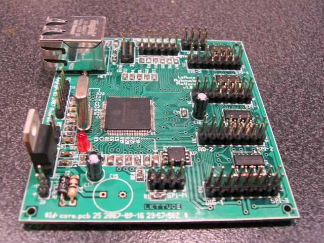
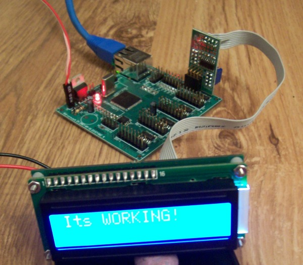

# lettuce
Networked embedded automation platform

**Note:** the lettuce system was developed between 2006-2010, and is no longer being actively developed.

Lettuce aims to be a networked embedded automation platform that is both lightweight and extensible. 
Its applications include automation, control and entertainment systems in the home, but is also suitable for use in industry.
For documentation please visit the [wiki](https://github.com/sconemad/lettuce/wiki).

*The Lettuce core board - the heart of the Lettuce system:*

*Working system, plugged into a serial LCD display:*

